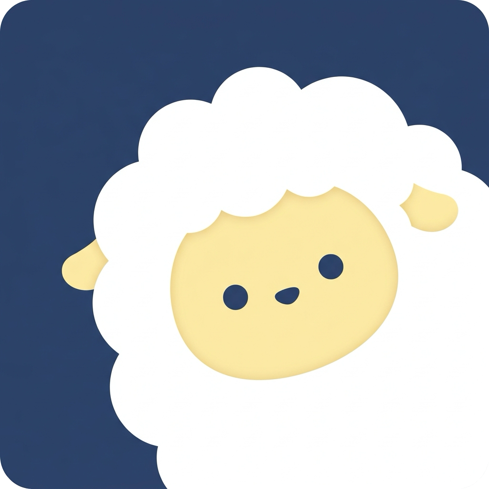

<p align="center">
  
</p>

<h1 align="center">fleecr</h1>

<p align="center">
  Yet another native macOS client for <a href="https://herdr.dev/">herdr</a>, bringing your AI coding agents and live terminals together in one simple interface.
</p>


<p align="center">
  <a href="https://github.com/voidyuu/fleecr/releases/latest"></a>
  
  
  <a href="LICENSE"></a>
</p>

<p align="center">
  <a href="README.md">English</a> · <a href="README_zh.md">简体中文</a>
</p>

---

<p align="center">
  
</p>

## ✨ Highlights

- **⚡ 100% Native & Fast** — Built with SwiftUI and AppKit. Zero Electron, instant launch, and minimal memory footprint.
- **💻 Powered by [libghostty](https://github.com/ghostty-org/ghostty)** — High-performance terminal emulation with real PTY attach, native text selection, Nerd Fonts, and 20+ built-in color themes.
- **🤖 Universal Agent Hub** — First-class support for Claude Code, Codex, Cursor, Gemini, Grok, OpenCode, pi, Kimi, and custom CLI agents.
- **🌐 Multi-Device Management** — Seamlessly manage local and remote machines over SSH (keys, passwords, or Tailscale) in a unified sidebar with auto-reconnect.
- **⌨️ Keyboard-Driven** — Global ⌘K quick search, split panes (⌘D / ⇧⌘D), tab cycling (⌃⇥ / ⌃⇧⇥), and ambient notification alerts.

## 📦 Installation

**Homebrew**
```sh
brew install voidyuu/tap/fleecr
```

**Manual**  
Download the latest universal binary from [Releases](https://github.com/voidyuu/fleecr/releases) and drag `Fleecr.app` into `/Applications`.

## 📋 Requirements

- macOS 14.0+ (Sonoma or later)
- [herdr](https://herdr.dev/) (fleecr automatically starts the local daemon if not running)

## 🔨 Build from Source

```sh
brew install xcodegen
make build   # Build Fleecr.app
make run     # Launch app
```

## 🙏 Thanks

- [missuo/herdrm](https://github.com/missuo/herdrm) — the project this work is based on.
- [herdr](https://herdr.dev/) — the backend foundation and runtime for agents, PTYs, and sessions.
- [libghostty](https://github.com/ghostty-org/ghostty) — fast, native terminal emulation.
- [s1dashu/ip-as-logo-skill](https://github.com/s1dashu/ip-as-logo-skill) — logo design.

## 📄 License

Licensed under the [MIT License](LICENSE).
