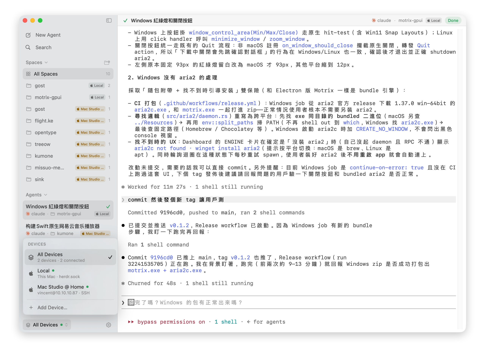
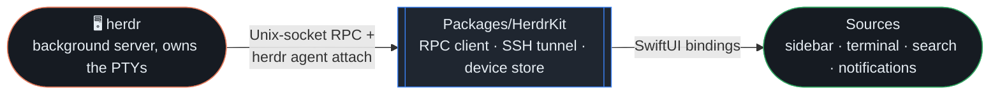

<p align="center">
  <picture>
    <source media="(prefers-color-scheme: dark)" srcset=".github/assets/herdrm-banner.png" />
    <source media="(prefers-color-scheme: light)" srcset=".github/assets/herdrm-banner-light.png" />
    
  </picture>
</p>

<p align="center">
  The native macOS console for <a href="https://herdr.dev">herdr</a> — see Claude Code, Codex,
  Gemini, Grok and OpenCode across your Mac and every SSH box you own, and jump into any one
  of them at full-TUI fidelity.
</p>

<p align="center">
  <a href="https://github.com/missuo/herdrm/releases/latest"></a>
  <a href="#-requirements"></a>
  <a href="https://github.com/missuo/herdrm/releases"></a>
  <a href="#-status"></a>
  <a href="#-contributing"></a>
</p>

<p align="center">
  <a href="#-what-it-does">What it does</a> ·
  <a href="#-why-herdrm">Why herdrm?</a> ·
  <a href="#-install">Install</a> ·
  <a href="#-quick-start">Quick Start</a> ·
  <a href="#-architecture">Architecture</a>
</p>

---

<p align="center">
  
</p>

## ✨ What it does

[herdr](https://herdr.dev) is the runtime your coding agents live on — a background server that
owns their terminals and knows which one is working, blocked, or done. **herdrm** is a native
macOS window on top of it, and it's grown well past "attach to a terminal":

| | |
|---|---|
| 🖥️ **Every device** | Local + remote over SSH — keys, Tailscale, or a Keychain password — with auto-reconnect |
| 🧭 **Live status** | Spaces, Agents & Terminals across every connected device |
| ⌨️ **Real terminal** | Full PTY attach, not a chat wrapper — native selection, legible fonts, resilient sessions |
| 📎 **Paste anything** | Files and images land straight in the agent's pane, locally or over SSH |
| 📁 **Move files** | Browse Local + SSH files side by side and copy in either direction |
| 🔔 **Notifications** | A system alert the moment an agent needs you — click it to jump right there |
| 🔍 **⌘K search** | Every agent, on every device, one keystroke away |

<details>
<summary><strong>See the full feature list</strong></summary>

### Every machine, one sidebar
- **All your devices, in parallel** — remote sockets forwarded over `ssh -L`, each on its own
  reconnect loop (1s → 30s backoff). The sidebar aggregates every device with a tinted OS badge;
  the bottom-left switcher filters by device.
- **Flexible SSH targets** — `user@host`, `user@host:port`, `ssh://` URIs, and `~/.ssh/config`
  aliases. Auth falls back OpenSSH keys/agent → **Tailscale SSH** (1.98.0+) → an in-app password
  prompt stored in the **macOS login Keychain**, never in a file.
- **Diagnosable failures** — "herdr isn't running on `<host>`", a misconfigured
  `AllowStreamLocalForwarding`, or *why* a disconnected device is unreachable — never a bare
  "not connected".

### Spaces, Agents & Terminals, always current
- **Spaces, Agents & Terminals sidebar** — every workspace, coding agent (claude, codex,
  gemini, grok, opencode, …), and ordinary Herdr shell pane, across local and SSH devices.
- **New Agent / New Terminal / New Space** — New Terminal creates a persistent shell tab in
  any device and space. Locally the agent picker only lists advertised CLIs found on the
  login-shell PATH (captured once from a real interactive + login shell, not by grepping rc
  files or trusting LaunchServices); SSH devices follow the remote server's manifest catalog
  and validate on start. Each agent's bypass-permissions flag is on by default. **⌘N** for a
  new agent, **⌘T** for a new terminal, **⇧⌘N** for a new space. New Space includes an inline directory browser that
  works over SSH. Settings → Agents accepts a per-kind binary path when detection is wrong.
- Spaces rename straight from the sidebar's context menu.

### A real terminal, not a chat wrapper
- **Live terminal** — attaches directly to an agent or shell PTY (`herdr agent attach` /
  `herdr terminal attach`); grabs
  keyboard focus the moment you jump in from ⌘K, the sidebar, or a notification.
- **Standalone terminals** — open a local login shell or choose any configured SSH device;
  remote shells reuse the same OpenSSH config, agent, host-key, and Keychain password flow.
- **Native text selection** — drag to select, no Shift needed; right-click for Copy/Paste/Select
  All plus link actions (⌘-click opens a URL).
- **Legibility controls** — Thin strokes, font Weight, and Line spacing settings.
- **Shift+Enter** inserts a line break instead of submitting; colors adapt correctly in Light
  mode instead of washing out.
- **Resilient sessions** — a dropped connection or a takeover shows a Reconnect button instead
  of freezing on the last frame; mixed-version `herdr` binaries no longer break attach.

### Files, search, and staying in the loop
- **Two-pane file manager** — browse Local and any configured SSH device side by side, then
  upload or download regular files with progress, cancellation, and explicit Replace / Keep
  Both conflict handling. Transfers use the same OpenSSH config, agent, host-key, and Keychain
  password flow as terminals.
- **Paste files and images** into Claude Code, Codex, Copilot, Cursor, Gemini, Grok, OpenCode,
  or pi. Local pastes forward as Ctrl+V so the agent reads the clipboard itself; remote pastes
  stream over SSH into a self-pruning cache (7-day retention, 50 MB cap) and paste the path.
- **Search** — ⌘K across every device, ordered by urgency, scrolling to follow your selection.
- **Notifications** — a sound and a system alert when any agent finishes or needs input;
  clicking jumps straight to it. Agents you're already watching stay quiet.

### Built like a native Mac app
- **Universal binary** — Apple Silicon and Intel, one download.
- **Light & dark**, auto-updates via [Sparkle](https://sparkle-project.org), signed and
  notarized.
- **HerdrKit** — the socket-RPC/SSH/device layer ships as its own, independently testable Swift
  package (`Packages/HerdrKit`).

</details>

## 🤔 Why herdrm?

You already run agents through herdr because the model is right — spaces, live status, real
PTYs, not a chat window pretending to be one. But living in `herdr attach` and a wall of
terminal panes is its own skill, and not everyone wants to be a tmux person to get the benefit.
herdrm is the same model, built for people who'd rather click:

- **Herdr's mechanics, an Apple-native interface.** Every space and agent is a sidebar row you
  click, not a session name you type — built in SwiftUI, so it looks and moves like a
  first-party Mac app, not a terminal skin bolted on top.
- **Native means fast.** No Electron, no browser engine underneath — herdrm launches instantly
  and stays light, the kind of responsiveness only a truly native app gets.
- **Still the real terminal when it matters.** Click an agent and you're on its actual PTY, full
  TUI, nothing summarized — you just don't have to live inside a multiplexer to get there.
- **One console, every machine.** Laptop, dev box, home server — all rows in the same sidebar.
- **You stop polling.** Status lives in the sidebar and in notifications, not in your head.
- **It gets out of the way.** ⌘K, ⌘N, paste-to-attach — no new mental model to learn.

## 📋 Requirements

- macOS 14+
- [herdr](https://herdr.dev) installed locally (herdrm starts it if it isn't running) and on
  your remote machines
- For remote devices: OpenSSH access, Tailscale SSH (1.98.0+), or a Keychain-stored password

## 📦 Install

**Homebrew**
```sh
brew install owo-network/brew/herdrm
```

**Manual** — download `herdrm-x.y.z.zip` from [Releases](https://github.com/missuo/herdrm/releases),
unzip, drag `herdrm.app` into `/Applications`. Either way it self-updates from then on — **HerdrM
→ Check for Updates…**, or **HerdrM → About HerdrM** for the version you're running.

## ⚡ Quick Start

```text
1. Launch herdrm            → no local herdr running? herdrm starts it for you
2. Add a device (optional)  → you@dev-box · you@dev-box:2222 · a Tailscale machine
3. ⌘N                       → pick a device + a CLI, you're attached to its live terminal
4. ⌘K                       → jump to any agent on any device, any time
```

## 🏗️ Architecture



- **[herdr](https://herdr.dev)** — the daemon: owns every agent's PTY, persists spaces, answers
  over a local Unix socket.
- **`Packages/HerdrKit`** — transport and domain layer, UI-independent and unit-tested on its
  own (`make kit-test`).
- **`Sources`** — the SwiftUI shell built on
  [Ghostty](https://ghostty.org) (`libghostty`).

## 🔨 Build from source

```sh
brew install xcodegen
make build   # xcodegen + xcodebuild → build/Build/Products/Debug/herdrm.app
make run
make kit-test  # HerdrKit integration tests (needs a running local herdr)
```

## 🤝 Contributing

Early-stage software, PRs genuinely welcome — small and single-purpose lands fastest.

- **Bug?** [Open an issue](https://github.com/missuo/herdrm/issues/new) with your macOS
  version, `herdr --version`, and repro steps.
- **Feature idea?** Open an issue first for anything beyond a small PR.
- **Sending a PR:** `make build` + `make kit-test` locally (no CI gate yet — this is the bar),
  plus a line under `## [Unreleased]` in `CHANGELOG.md` (release automation requires it).

## 🙏 Credits

- [herdr](https://herdr.dev) — the agent runtime this app is a console for.
- [Heeler](https://github.com/ZingerLittleBee/Heeler) — iOS herdr client; domain model and
  transport patterns.
- [waku](https://github.com/egoist/waku) — sidebar design reference.
- [Ghostty](https://ghostty.org) — terminal emulation (`libghostty`).
- [Sparkle](https://sparkle-project.org) — auto-updates.
- [Lobe Icons](https://github.com/lobehub/lobe-icons) / [Simple Icons](https://simpleicons.org) — brand icons.

## <a name="-status"></a>⚠️ Status

**Early stage**, without full test coverage — expect bugs. Issues and PRs are very welcome.

## ⭐ Star History

<p align="center">
  <a href="https://star-history.com/#missuo/herdrm&Date">
    <picture>
      <source media="(prefers-color-scheme: dark)" srcset="https://api.star-history.com/svg?repos=missuo/herdrm&type=Date&theme=dark" />
      <source media="(prefers-color-scheme: light)" srcset="https://api.star-history.com/svg?repos=missuo/herdrm&type=Date" />
      
    </picture>
  </a>
</p>
